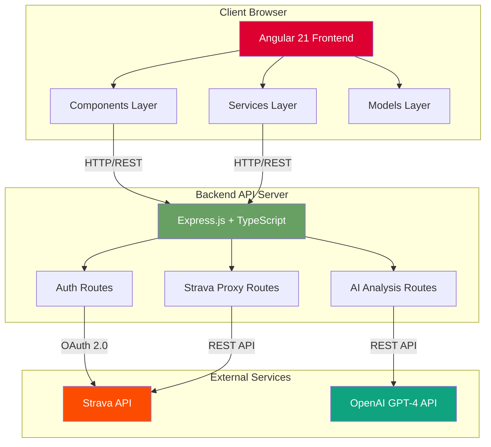
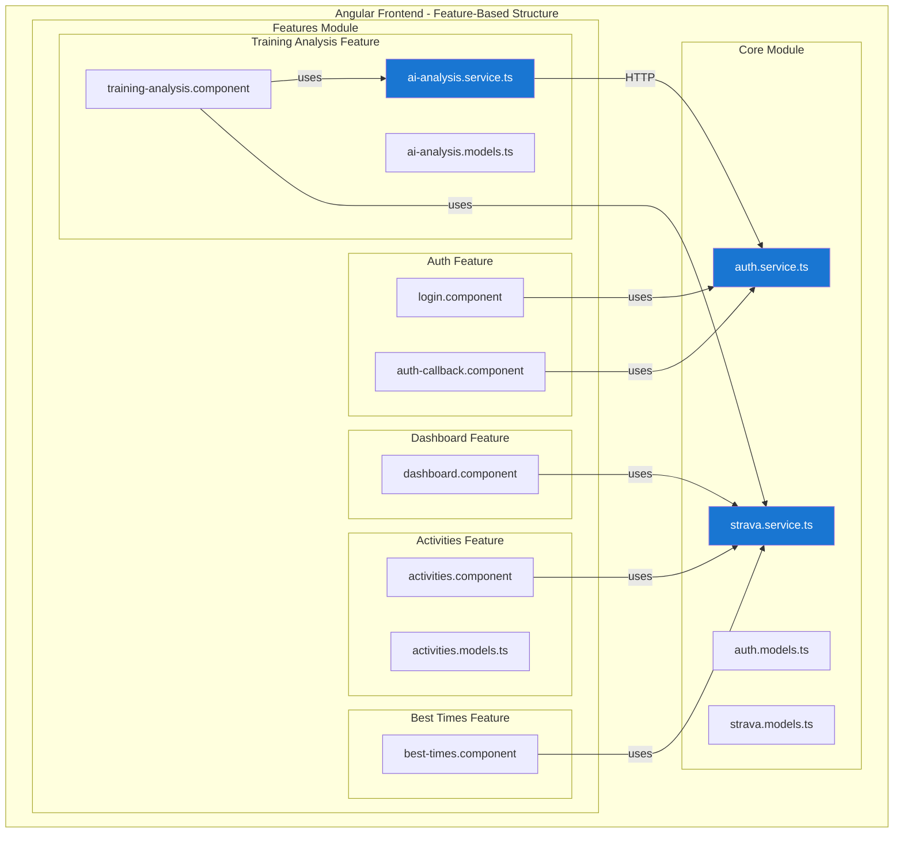
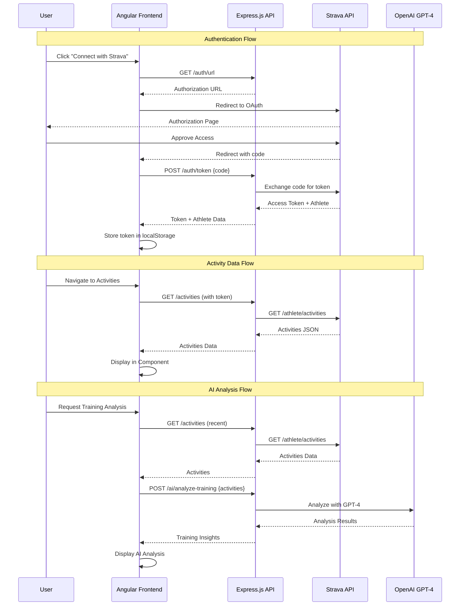
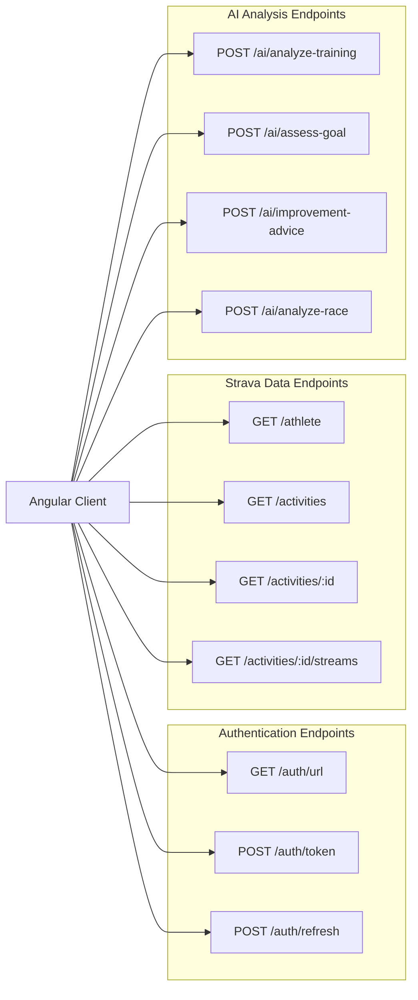
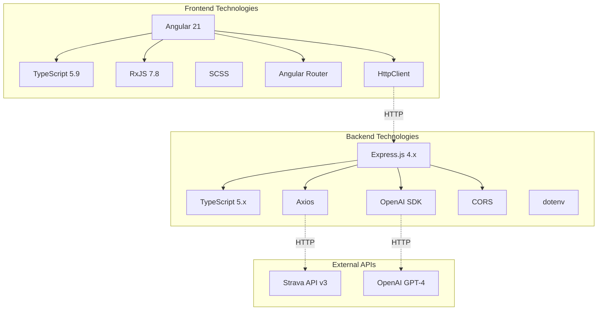
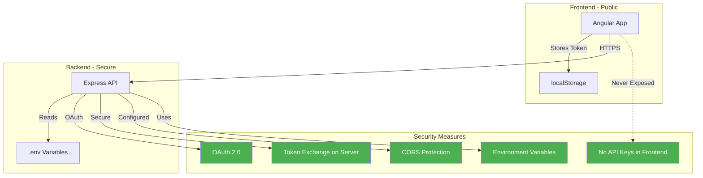
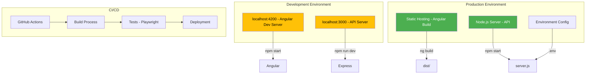
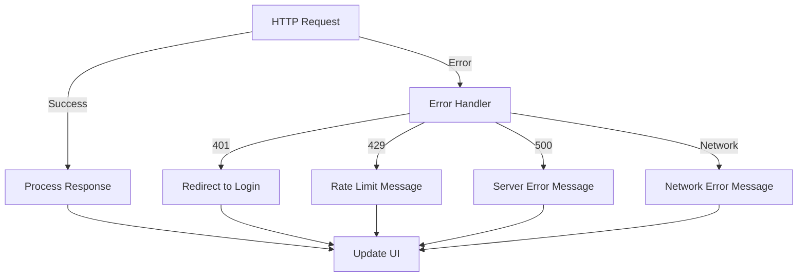

# Running Agent - Architecture Diagram

## System Architecture

This document provides a visual representation of the Running Agent application architecture, showing the relationships between the Angular frontend, Express.js backend API, and external services.

## High-Level Architecture



## Detailed Component Architecture



## Data Flow Diagram



## Backend API Endpoints



## Technology Stack



## Security Architecture



## Deployment Architecture



## Key Design Patterns

### 1. **Feature-Based Folder Structure**
- Organizes code by business features rather than technical layers
- Each feature has its components, services, and models co-located
- Follows John Papa's Angular Style Guide

### 2. **Service Layer Pattern**
- Core services (`auth.service`, `strava.service`) handle all API communication
- Feature-specific services (`ai-analysis.service`) handle specialized logic
- Services are singleton and dependency-injected

### 3. **Reactive Programming**
- Uses RxJS Observables for async data streams
- BehaviorSubject for state management (currentUser)
- Operators like `map`, `tap`, `catchError` for data transformation

### 4. **API Proxy Pattern**
- Backend API acts as secure proxy to external services
- Prevents exposure of API keys and secrets
- Centralizes authentication and error handling

### 5. **OAuth 2.0 Flow**
- Standard three-legged OAuth for user authorization
- Token exchange happens server-side
- Refresh token mechanism for long-lived sessions

## Component Communication

```mermaid
graph LR
    subgraph "Parent-Child Communication"
        P[Parent Component] -->|@Input| C[Child Component]
        C -->|@Output| P
    end
    
    subgraph "Service-Based Communication"
        C1[Component 1] -->|Inject| S[Shared Service]
        S -->|Observable| C2[Component 2]
    end
    
    subgraph "Router State"
        R[Router] -->|Params| RC[Routed Component]
        RC -->|Navigate| R
    end
```

## Performance Considerations

- **Lazy Loading**: Routes can be lazy-loaded for faster initial load
- **Change Detection**: OnPush strategy for optimized rendering
- **HTTP Caching**: Browser caching for static assets
- **API Pagination**: Activities loaded in batches (30 per page)
- **Observable Unsubscription**: Proper cleanup to prevent memory leaks

## Error Handling



## Future Enhancements

1. **State Management**: Consider NgRx for complex state
2. **Progressive Web App**: Add service workers for offline support
3. **Real-time Updates**: WebSocket integration for live data
4. **Advanced Caching**: IndexedDB for offline activity storage
5. **Multi-language Support**: i18n internationalization
6. **Analytics**: User behavior tracking and performance monitoring

## Related Documentation

- [BACKEND_API_SETUP.md](../BACKEND_API_SETUP.md) - Backend setup guide
- [FEATURES.md](../FEATURES.md) - Feature documentation
- [AGENTS.md](../AGENTS.md) - Development guidelines and style guide
- [README.md](../README.md) - Project overview
